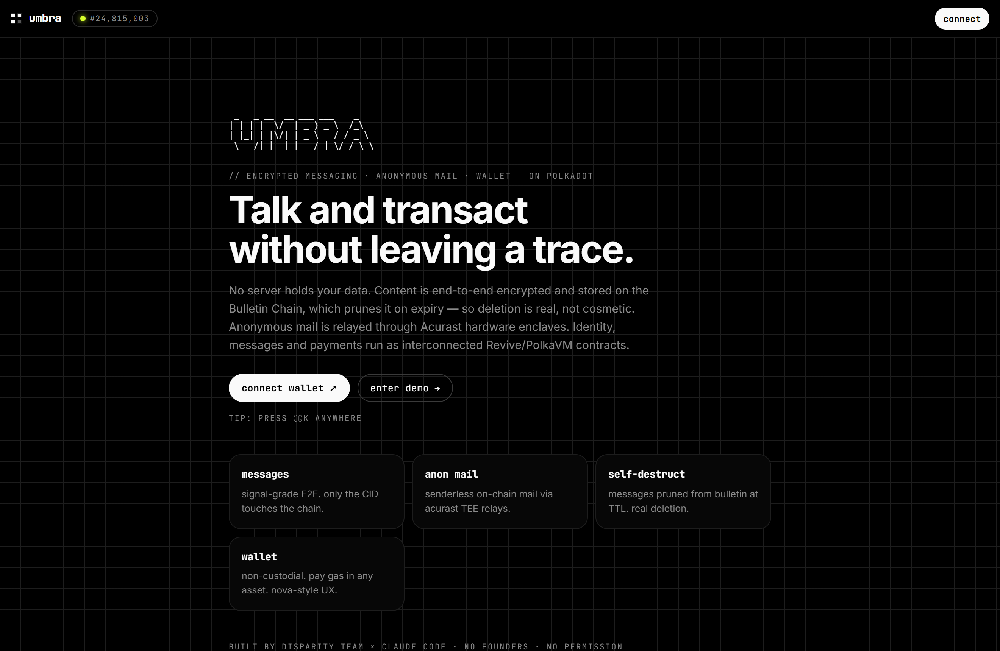
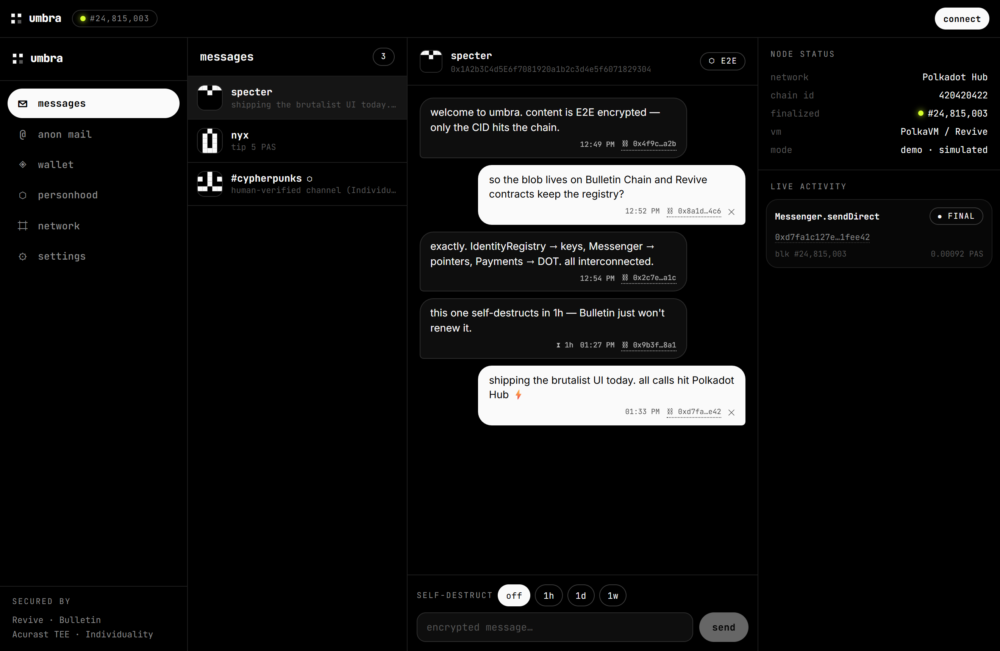
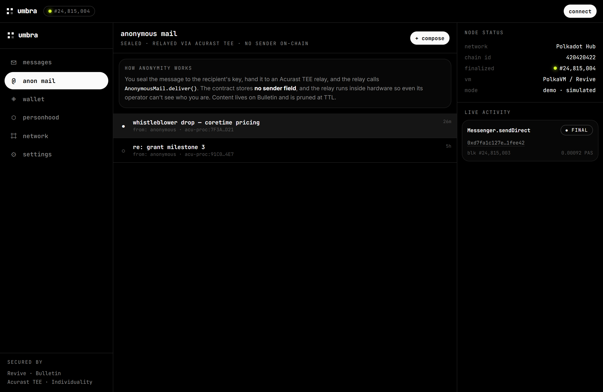
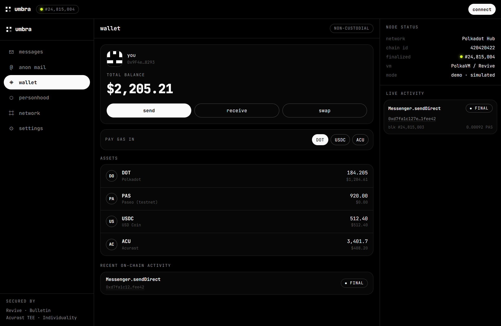
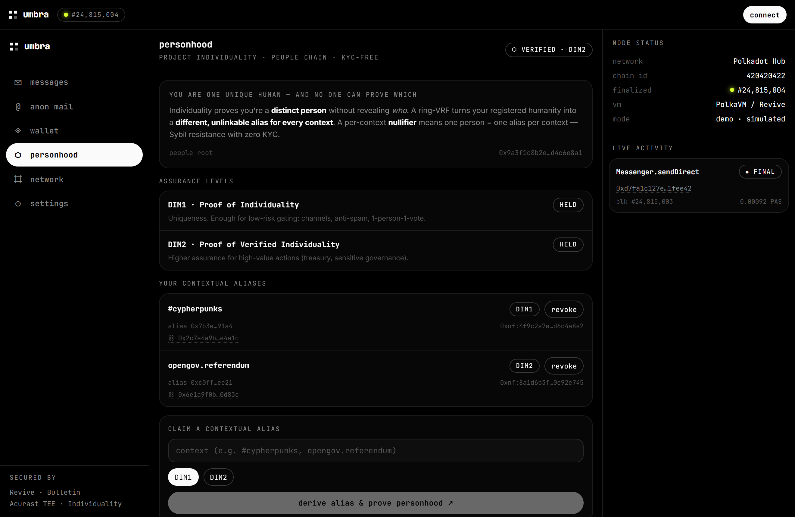
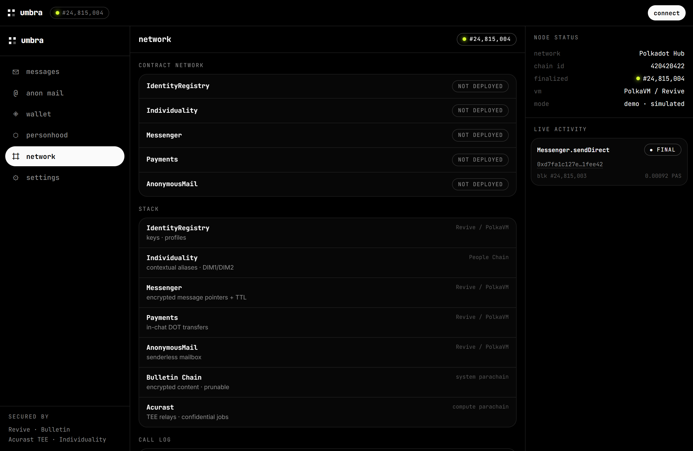
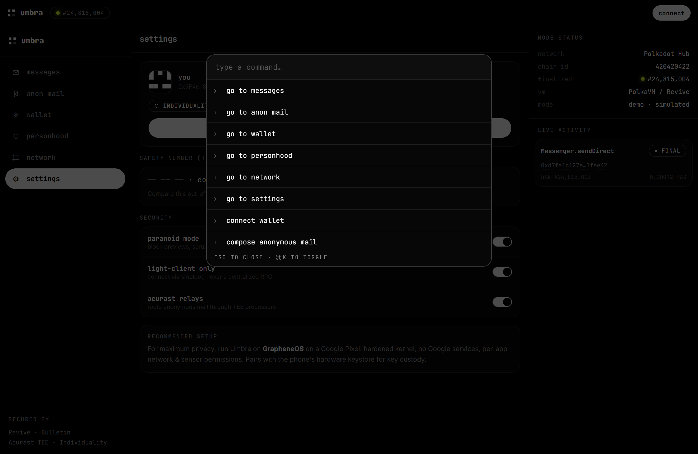
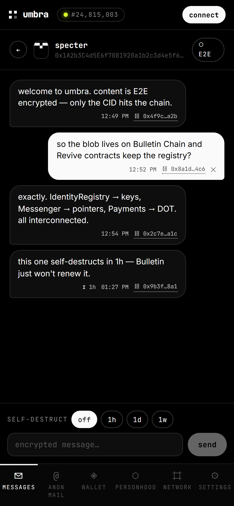
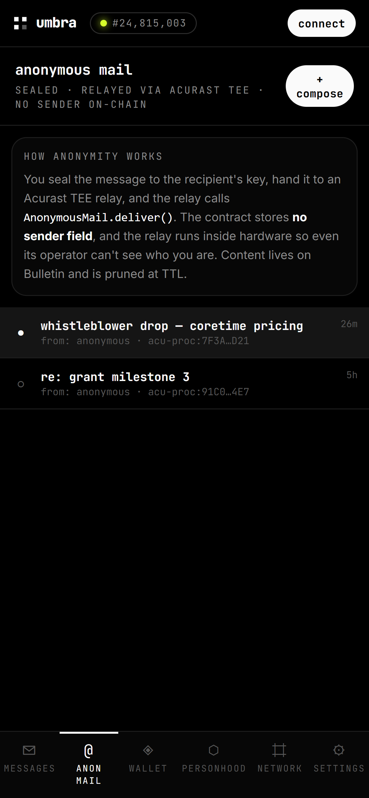

<div align="center">

```
██╗   ██╗███╗   ███╗██████╗ ██████╗  █████╗
██║   ██║████╗ ████║██╔══██╗██╔══██╗██╔══██╗
██║   ██║██╔████╔██║██████╔╝██████╔╝███████║
██║   ██║██║╚██╔╝██║██╔══██╗██╔══██╗██╔══██║
╚██████╔╝██║ ╚═╝ ██║██████╔╝██║  ██║██║  ██║
 ╚═════╝ ╚═╝     ╚═╝╚═════╝ ╚═╝  ╚═╝╚═╝  ╚═╝
```

**encrypted messaging · anonymous on-chain mail · non-custodial wallet — on Polkadot**

*Talk and transact without leaving a trace.*

`Revive/PolkaVM` · `Bulletin Chain` · `Acurast TEE` · `Individuality`

</div>

---

> Umbra is a privacy-first super-app: Signal-style messaging, a Nova-style
> wallet, and anonymous mail — all on Polkadot. No server holds your data.
> Content is end-to-end encrypted and stored on the **Bulletin Chain**, which
> *prunes* it on expiry, so **deletion is real, not cosmetic**. Read the
> [MANIFESTO](MANIFESTO.md).

## Why Umbra

| | |
|---|---|
| 🔐 **E2E encrypted** | Messages are sealed client-side (NaCl box). Only an opaque CID touches the chain — never plaintext. |
| 🕯️ **Real deletion** | Content lives on the Bulletin Chain (a *prunable*, non-immutable system parachain). Disappearing messages aren't "hidden" — they're gone at TTL. |
| 📨 **Anonymous mail** | On-chain mailbox with **no sender field**. Relayed through Acurast hardware enclaves — the system can't betray what it never knew. |
| ◈ **Non-custodial wallet** | Your keys, your assets. In-chat DOT payments. Pay gas in any asset. |
| ⬡ **Proof of personhood** | Individuality done right: prove you're a *unique human* via **unlinkable contextual aliases** (ring-VRF + nullifiers), never a global identity. Gates channels & one-person-one-vote without KYC. See [INDIVIDUALITY.md](docs/INDIVIDUALITY.md). |
| ⌗ **Light-client first** | Connect directly to the network. No RPC overlord, no single throat to choke. |

## Live demo

A static demo (simulated chain) is published via GitHub Pages on every push to
`main` — see [`.github/workflows/pages.yml`](.github/workflows/pages.yml). Enable
it once under **Settings → Pages → Source: GitHub Actions**; the URL is then
`https://<user>.github.io/<repo>/`.

## Screenshots

| Landing | Messages | Anonymous mail |
|---|---|---|
|  |  |  |

| Wallet | Personhood (Individuality) | Network console |
|---|---|---|
|  |  |  |

| Command palette (⌘K) | Mobile thread | Mobile mail |
|---|---|---|
|  |  |  |

Full walkthrough: [docs/SHOWCASE.md](docs/SHOWCASE.md).

> The current build runs in **demo mode**: on-chain transactions and Bulletin /
> Acurast interactions are **simulated** end-to-end so the app is fully
> demonstrable without a funded account. The cryptography is real.

## Architecture

```
┌────────────────── Frontend (React + Vite, B/W terminal UI) ──────────────────┐
│  EIP-1193 wallet (MetaMask/Talisman)     E2E encryption (NaCl box)            │
└───────────────┬───────────────────────────────────────┬──────────────────────┘
                │ ethers.js (Revive RPC)                 │ CID
        ┌───────▼──────────┐                     ┌───────▼─────────────┐
        │   Polkadot Hub   │                     │   Bulletin Chain    │
        │ (PolkaVM/Revive) │                     │ encrypted · prunable│
        │                  │                     └─────────────────────┘
        │  IdentityRegistry ─┐  keys · profiles · personhood                    ▲
        │  Messenger ────────┼─ encrypted message pointers + TTL                │ relay
        │  Payments ─────────┤  in-chat DOT transfers                  ┌────────┴────────┐
        │  AnonymousMail ────┘  senderless mailbox  ◀─────────────────│  Acurast (TEE)  │
        └──────────────────┘                                          │ confidential job│
                                                                      └─────────────────┘
```

See [docs/ARCHITECTURE.md](docs/ARCHITECTURE.md) and the Acurast integration
proposal in [docs/ACURAST.md](docs/ACURAST.md).

## Repo layout

```
umbra/
├─ contracts/      # Solidity + Hardhat (resolc → PolkaVM)
│  ├─ contracts/   #   IdentityRegistry · Individuality · Messenger · Payments · AnonymousMail
│  ├─ scripts/     #   deploy.ts (deploys + writes ABIs/addresses to the frontend)
│  └─ test/        #   umbra.test.ts
├─ frontend/       # React + Vite + ethers + tweetnacl, monochrome terminal UI
│  └─ src/
│     ├─ components/  TopBar · Rail · TabBar · Aside · CommandPalette · views/
│     ├─ lib/         wallet.ts · crypto.ts · bulletin.ts · chain.ts
│     ├─ hooks/       useApp.ts (store) + demoData.ts
│     └─ contracts/   ABIs + addresses (generated by deploy)
├─ MANIFESTO.md · DISCLAIMER.md · SECURITY.md
```

## Quick start

```bash
npm install
cp .env.example .env

# Frontend (starts in DEMO mode, real crypto pipeline)
npm run dev            # → http://localhost:5173
```

Press **⌘K / Ctrl-K** anywhere for the command palette.

### Deploy the contracts (TestNet)

```bash
npm run contracts:build
npm run contracts:deploy   # writes frontend/src/contracts/addresses.local.json
```

Fund a test account from the Polkadot Hub TestNet faucet and set
`DEPLOYER_PRIVATE_KEY` in `.env`. Once addresses are written, the frontend flips
to **live mode** and uses the real `Messenger` / `Payments` / `AnonymousMail`.

## Roadmap

- [ ] Real Bulletin Chain writes via **Polkadot-API (PAPI) + smoldot** light client
- [ ] On-chain CID publishing (`Messenger.sendDirect`) — hook already in `useApp`
- [ ] Message read via `MessageSent` events + indexing
- [ ] **Acurast** TEE relay for anonymous mail + decentralized push (see [ACURAST.md](docs/ACURAST.md))
- [ ] Wire the **People Chain** ring-VRF verifier for real contextual-alias proofs (model already in `Individuality.sol`)
- [ ] Mobile builds (recommended: **GrapheneOS** on a Pixel)

## Security

This is **experimental, unaudited** software. See [SECURITY.md](SECURITY.md) for
the threat model and [DISCLAIMER.md](DISCLAIMER.md) before doing anything real
with it.

## References

- Smart contracts on Polkadot Hub — https://docs.polkadot.com/reference/polkadot-hub/smart-contracts/
- Bulletin Chain — https://docs.polkadot.com/chain-interactions/store-data/bulletin-chain/
- Acurast — https://docs.acurast.com/
- AI resources (llms.txt) — https://docs.polkadot.com/ai-resources/

---

<div align="center">
<sub>Built by <b>DisParity Team</b> × Claude Code · no founders · no foundation · no permission<br>
Independent project. Not affiliated with Parity Technologies, the Web3 Foundation, or Acurast. See <a href="DISCLAIMER.md">DISCLAIMER</a>.</sub>
</div>
