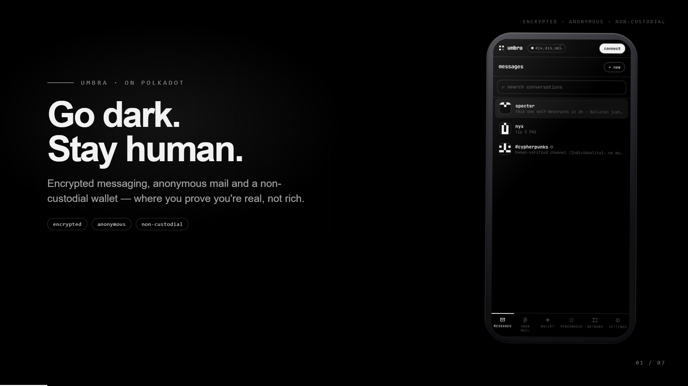
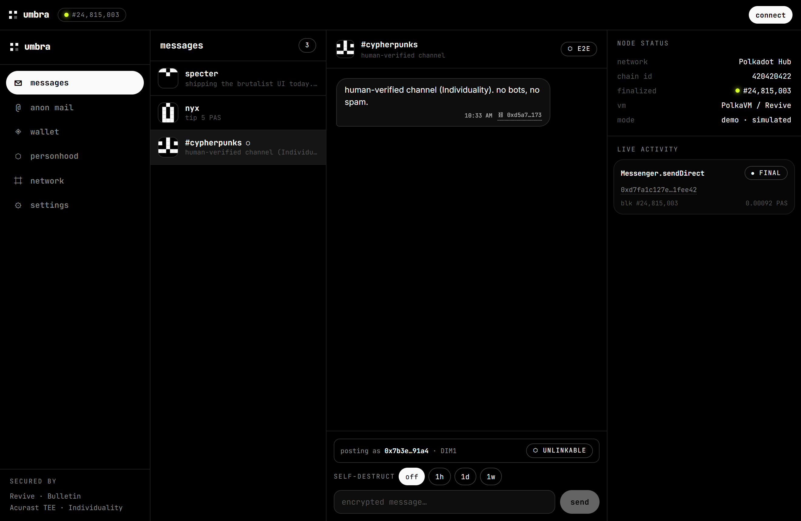
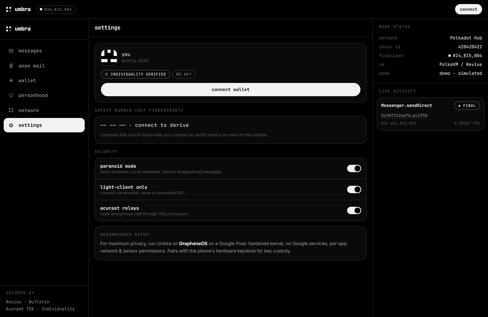
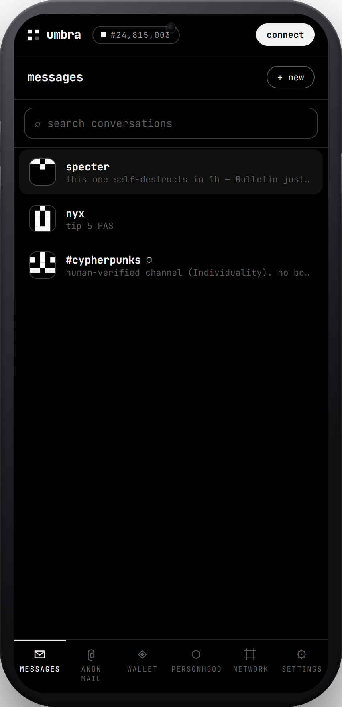
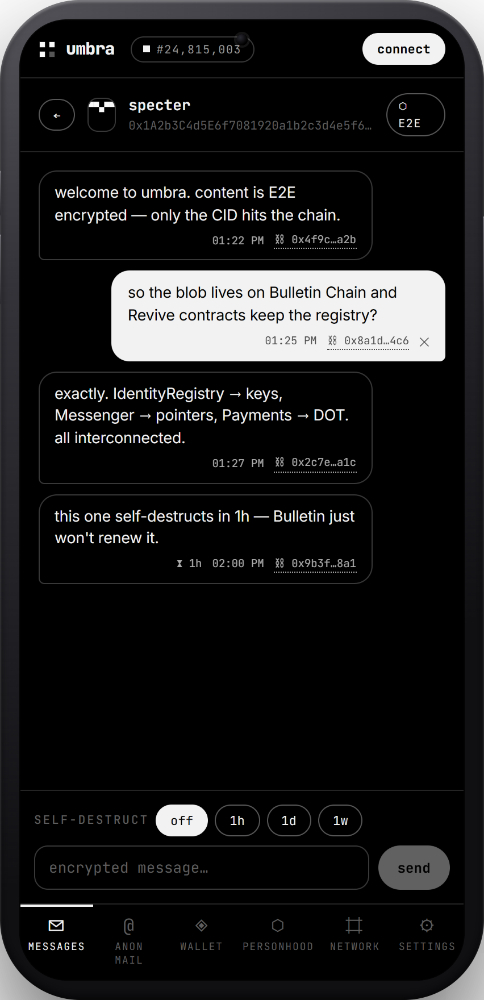
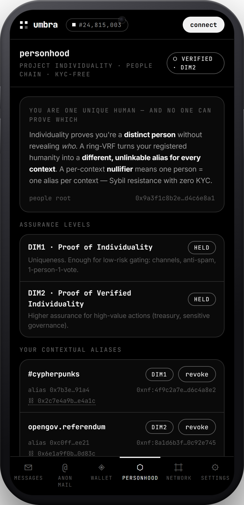
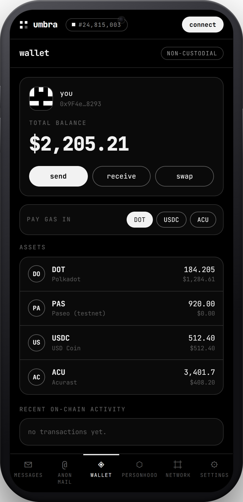

<div align="center">

```
██╗   ██╗███╗   ███╗██████╗ ██████╗  █████╗
██║   ██║████╗ ████║██╔══██╗██╔══██╗██╔══██╗
██║   ██║██╔████╔██║██████╔╝██████╔╝███████║
██║   ██║██║╚██╔╝██║██╔══██╗██╔══██╗██╔══██║
╚██████╔╝██║ ╚═╝ ██║██████╔╝██║  ██║██║  ██║
 ╚═════╝ ╚═╝     ╚═╝╚═════╝ ╚═╝  ╚═╝╚═╝  ╚═╝
```

# Go dark. Stay human.

**encrypted messaging · anonymous on-chain mail · non-custodial wallet — on Polkadot**

*Talk and transact without leaving a trace.*

`Revive/PolkaVM` · `Bulletin Chain` · `Acurast TEE` · `Individuality`

[Production status](docs/PRODUCTION.md) · [Audit](docs/AUDIT.md) · [Architecture](docs/ARCHITECTURE.md) · [Demo video](docs/media/umbra-demo.webm)

</div>

---

> Umbra is a privacy-first super-app on Polkadot where access is gated by proof
> of **personhood**, not proof of wealth. Signal-style messaging, a Nova-style
> wallet, and anonymous mail. No server
> holds your data: content is end-to-end encrypted and stored on the **Bulletin
> Chain**, which *prunes* it on expiry, so **deletion is real, not cosmetic**.
> Read the [MANIFESTO](MANIFESTO.md).

## Demo

A 16:9 product film — animated copy beside a phone cycling the live app (demo
mode: real crypto, simulated chain). Narration + scenes: [docs/PRESENTATION.md](docs/PRESENTATION.md).

<!-- Clickable poster (always renders on GitHub) → opens the promo video. -->
<a href="docs/media/umbra-promo.webm">
  
</a>

<details>
<summary>▶ players — promo (16:9) · mobile (in-device) · desktop</summary>

<video src="docs/media/umbra-promo.webm" controls width="100%"></video>
<video src="docs/media/umbra-demo-mobile.webm" controls height="520"></video>
<video src="docs/media/umbra-demo.webm" controls width="100%"></video>

> If a player doesn't load in your GitHub view, click the poster or open the
> `.webm` files in [`docs/media/`](docs/media/) directly. Tip: drag a `.webm`
> into a GitHub issue/release to get an embeddable `user-images` URL.

</details>

## Why Umbra

| | |
|---|---|
| 🔐 **E2E encrypted** | Messages are sealed client-side (NaCl box). Only an opaque CID touches the chain — never plaintext. |
| 🕯️ **Real deletion** | Content lives on the Bulletin Chain (a *prunable*, non-immutable system parachain). Disappearing messages aren't "hidden" — they're gone at TTL. |
| 📨 **Anonymous mail** | On-chain mailbox with **no sender field**. Relayed through Acurast hardware enclaves — the system can't betray what it never knew. |
| ◈ **Non-custodial wallet** | Your keys, your assets. In-chat DOT payments. Pay gas in any asset. |
| ⬡ **Proof of personhood** | Individuality done right: prove you're a *unique human* via **unlinkable contextual aliases** (ring-VRF + nullifiers), never a global identity. Gates channels & one-person-one-vote without KYC. See [INDIVIDUALITY.md](docs/INDIVIDUALITY.md). |
| ⌗ **Light-client first** | Connect directly to the network. No RPC overlord, no single throat to choke. |

## Live demo

A static demo (simulated chain) is published via GitHub Pages on every push to
`main` — see [`.github/workflows/pages.yml`](.github/workflows/pages.yml). Enable
it once under **Settings → Pages → Source: GitHub Actions**; the URL is then
`https://<user>.github.io/<repo>/`.

## Screenshots

| Landing | Messages | Anonymous mail |
|---|---|---|
|  |  |  |

| Wallet | Personhood (Individuality) | Network console |
|---|---|---|
|  |  |  |

| Command palette (⌘K) | Channel (contextual alias) | Settings |
|---|---|---|
|  |  |  |

### Mobile (in-device)

<p>
  
  
  
  
</p>

Full walkthrough: [docs/SHOWCASE.md](docs/SHOWCASE.md).

> The current build runs in **demo mode**: on-chain transactions and Bulletin /
> Acurast interactions are **simulated** end-to-end so the app is fully
> demonstrable without a funded account. The cryptography is real.

## Architecture

```
┌──────────────── Frontend (React + Vite, Apple-style glass UI) ───────────────┐
│  EIP-1193 wallet (MetaMask/Talisman)     E2E encryption (NaCl box)            │
└───────────────┬───────────────────────────────────────┬──────────────────────┘
                │ ethers.js (Revive RPC)                 │ CID
        ┌───────▼──────────┐                     ┌───────▼─────────────┐
        │   Polkadot Hub   │                     │   Bulletin Chain    │
        │ (PolkaVM/Revive) │                     │ encrypted · prunable│
        │                  │                     └─────────────────────┘
        │  IdentityRegistry ─┐  keys · profiles · personhood                    ▲
        │  Messenger ────────┼─ encrypted message pointers + TTL                │ relay
        │  Payments ─────────┤  in-chat DOT transfers                  ┌────────┴────────┐
        │  AnonymousMail ────┘  senderless mailbox  ◀─────────────────│  Acurast (TEE)  │
        └──────────────────┘                                          │ confidential job│
                                                                      └─────────────────┘
```

See [docs/ARCHITECTURE.md](docs/ARCHITECTURE.md) and the Acurast integration
proposal in [docs/ACURAST.md](docs/ACURAST.md).

## Repo layout

```
umbra/
├─ contracts/      # Solidity + Hardhat (resolc → PolkaVM)
│  ├─ contracts/   #   IdentityRegistry · Individuality · Messenger · Payments · AnonymousMail
│  ├─ scripts/     #   deploy.ts (deploys + writes ABIs/addresses to the frontend)
│  └─ test/        #   umbra.test.ts
├─ frontend/       # React + Vite + ethers + tweetnacl, Apple-style glass UI
│  └─ src/
│     ├─ components/  TopBar · Rail · TabBar · Aside · CommandPalette · views/
│     ├─ lib/         wallet · crypto · bulletin · chain · onchain · relay · bulletin-papi
│     ├─ hooks/       useApp.ts (store) + demoData.ts
│     └─ contracts/   ABIs + addresses (generated by deploy)
├─ acurast/        # relay.job.ts — Acurast TEE workload (anonymous mail relay)
├─ MANIFESTO.md · DISCLAIMER.md · SECURITY.md
```

## Quick start

```bash
npm install
cp .env.example .env

# Frontend (starts in DEMO mode, real crypto pipeline)
npm run dev            # → http://localhost:5173
```

Press **⌘K / Ctrl-K** anywhere for the command palette.

### Deploy the contracts (TestNet)

```bash
npm run contracts:build
npm run contracts:deploy   # writes frontend/src/contracts/addresses.local.json
```

Fund a test account from the Polkadot Hub TestNet faucet and set
`DEPLOYER_PRIVATE_KEY` in `.env`. Once addresses are written, the frontend flips
to **live mode** and performs real on-chain calls.

### Run the contract tests

```bash
npm test --workspace contracts   # 12 passing
```

## Documentation

| Doc | What's in it |
|---|---|
| [docs/PRODUCTION.md](docs/PRODUCTION.md) | **Would it work on-chain?** Component-by-component readiness matrix, what's verified, what's needed for mainnet. |
| [docs/ARCHITECTURE.md](docs/ARCHITECTURE.md) | Layers, trust boundaries, accounts, data model, key flows, build/deploy. |
| [docs/DEPLOY.md](docs/DEPLOY.md) | Deploy to Polkadot Hub TestNet: faucet, env, compile (PolkaVM), deploy + wire, go live. |
| [docs/CONTRACTS.md](docs/CONTRACTS.md) | Full contract reference: storage, functions, access, reverts, events, invariants. |
| [docs/AUDIT.md](docs/AUDIT.md) | Internal security audit: scope, method, severity-rated findings, fixes. |
| [SECURITY.md](SECURITY.md) | Cryptographic protocol spec + threat model + known limitations. |
| [docs/PRESENTATION.md](docs/PRESENTATION.md) · [docs/SHOWCASE.md](docs/SHOWCASE.md) | Video script + narrated walkthrough · annotated screenshots. |
| [docs/INDIVIDUALITY.md](docs/INDIVIDUALITY.md) | Proof-of-personhood (contextual aliases, nullifiers, DIM). |
| [docs/ACURAST.md](docs/ACURAST.md) | TEE relay design for anonymous mail + confidential jobs. |
| [MANIFESTO.md](MANIFESTO.md) · [DISCLAIMER.md](DISCLAIMER.md) | Why we build · independence & legal. |

## Status

> Contracts compile to **EVM (solc 0.8.26)** and **PolkaVM (`resolc` 0.3.0)** and
> pass **12/12** tests. Several subsystems (Bulletin writes, Acurast relay, real
> ring-VRF personhood, group encryption) are scaffolds/mocks — full details and
> the path to mainnet in [docs/PRODUCTION.md](docs/PRODUCTION.md).

- ✅ **Smart contracts** — IdentityRegistry, Individuality, Messenger, Payments, AnonymousMail. **12/12 tests passing** (`npm test --workspace contracts`), compile to PolkaVM, CI on every push.
- ✅ **Live-mode on-chain calls wired** — register, `sendDirect` (encrypt → Bulletin CID → chain), `tip`, `registerAlias`, and event-based message reads live in [`frontend/src/lib/onchain.ts`](frontend/src/lib/onchain.ts); they run automatically once contracts are deployed.
- ✅ **Demo mode** — real client-side crypto + simulated chain, so the app is fully demonstrable without funds.

- ✅ **Bulletin Chain via PAPI** — real `TransactionStorage.store` + CIDv1 client in [`frontend/src/lib/bulletin-papi.ts`](frontend/src/lib/bulletin-papi.ts) (needs a Substrate signer / endpoint to run).
- ✅ **Acurast relay** — deployable TEE workload [`acurast/relay.job.ts`](acurast/relay.job.ts) + client [`frontend/src/lib/relay.ts`](frontend/src/lib/relay.ts) for live anonymous mail.
- ✅ **Live paths for all surfaces** — DM, channel, tip, alias on-chain; mail via relay.
- ✅ **Event indexer** — `watchDirectMessages` backfills `MessageSent` history + subscribes live (`lib/onchain.ts`).
- ✅ **Smoldot light-client** path for Bulletin (`smoldotProvider` in `lib/bulletin-papi.ts`).
- ✅ **Internal audit** — [docs/AUDIT.md](docs/AUDIT.md); two info-level findings fixed, the rest acknowledged with mitigations.

### Roadmap (remaining — needs external SDKs / live networks)

- [ ] **People Chain ring-VRF**: real proof generation + a real `IRingVrfVerifier` replacing the mock (interface ready; the mock accepts all proofs).
- [ ] **MLS group keys** for channels (currently a derived shared key — MVP; see [SECURITY.md](SECURITY.md)).
- [ ] **Double Ratchet** for DM forward secrecy.
- [ ] Deploy + verify on **Polkadot Hub TestNet** with `resolc` artifacts; reconcile Bulletin CIDs against the chain.
- [ ] Mobile builds (recommended: **GrapheneOS** on a Pixel).

> Honest status: the **contract layer is deployable** (compiles EVM + PolkaVM,
> 12/12 tests) but the items above require external SDKs/live networks and are
> **not** wired/verified here. The repo is a faithful reference + demo, not a
> shipped product. Full breakdown: [docs/PRODUCTION.md](docs/PRODUCTION.md).

## Security

**Experimental, unaudited** (only an [internal review](docs/AUDIT.md)). See
[SECURITY.md](SECURITY.md) for the threat model and [DISCLAIMER.md](DISCLAIMER.md)
before doing anything real with it.

## References

- Smart contracts on Polkadot Hub — https://docs.polkadot.com/reference/polkadot-hub/smart-contracts/
- Bulletin Chain — https://docs.polkadot.com/chain-interactions/store-data/bulletin-chain/
- Acurast — https://docs.acurast.com/
- AI resources (llms.txt) — https://docs.polkadot.com/ai-resources/

---

<div align="center">
<sub>Built by <b>DisParity Team</b> × Claude Code · no founders · no foundation · no permission<br>
Independent project. Not affiliated with Parity Technologies, the Web3 Foundation, or Acurast. See <a href="DISCLAIMER.md">DISCLAIMER</a>.</sub>
</div>
