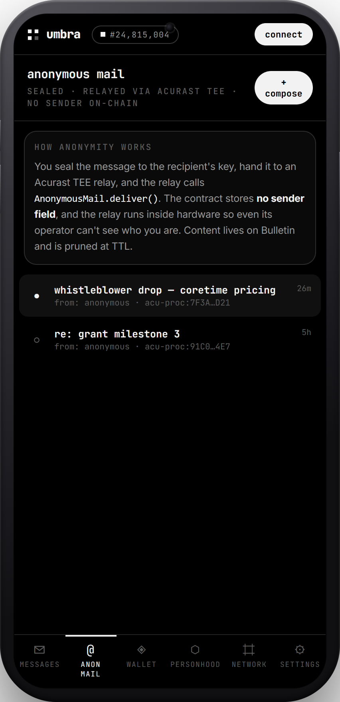
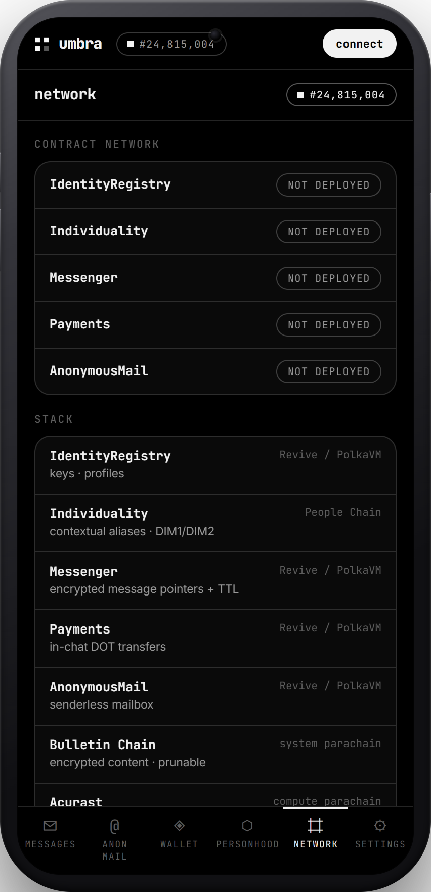

# Umbra — visual showcase

A guided tour of the app. All on-chain activity shown here is **simulated demo
mode** (real cryptography, simulated transactions) so the product is fully
demonstrable without a funded account.

---

## Landing

The entry point: an Apple-style hero on a deep gradient — large SF headline with
a systemBlue accent, glass feature cards, live block height in the top bar.

---

## Messages — Signal-style, on Polkadot

Conversations with `specter`, `nyx` and the human-verified `#cypherpunks`
channel. Each message is E2E encrypted client-side; only the CID + an on-chain
tx pointer are stored. Note the **self-destruct** presets and the **live
activity** rail showing `Messenger.sendDirect ● FINAL` with a real-looking tx
hash, block and fee.

---

## Personhood-gated channels

A human-verified channel uses its own id as the Individuality **context**: you
post under your **unlinkable contextual alias** for that channel (`posting as
0x… · DIM1 · unlinkable`). One human, one voice per room — without anyone
learning which human.

---

## Anonymous mail — no sender on-chain

Sealed mail relayed through Acurast TEE processors. The contract stores **no
sender field**; the inbox shows `from: anonymous · acu-proc:…`. Content lives on
Bulletin and is pruned at TTL.

---

## Wallet — non-custodial, Nova-style

Total balance, send/receive/swap, a **pay-gas-in-any-asset** selector (a
Polkadot Hub 2026 capability), the asset list, and recent on-chain activity.

---

## Personhood — Individuality, done right

Proof of personhood as Gavin Wood imagined it: prove you're a **unique human**
without a global identity. **Contextual aliases** (ring-VRF) give you a
different, unlinkable pseudonym per context; **nullifiers** allow one alias per
person per context (Sybil resistance, zero KYC); **DIM1/DIM2** assurance levels.

---

## Network console

The contract network and stack at a glance, plus a terminal-style call log of
finalized transactions — `$ umbra --watch polkadot-hub`.

---

## Settings — keys, safety number, paranoid mode

Identity + key fingerprint (Signal-style safety number), security toggles
(paranoid mode, light-client-only, Acurast relays) and the GrapheneOS hardening
recommendation.

---

## Command palette (⌘K)

Keyboard-driven navigation and actions — because devs.

---

## Mobile (primary target)

Mobile-first layout with a bottom tab bar, shown in-device. 🎬 Mobile video:
[`media/umbra-demo-mobile.webm`](media/umbra-demo-mobile.webm).

  
  
  

  
  
  

---

Built by <b>DisParity Team</b> × Claude Code · no founders · no foundation · no permission

